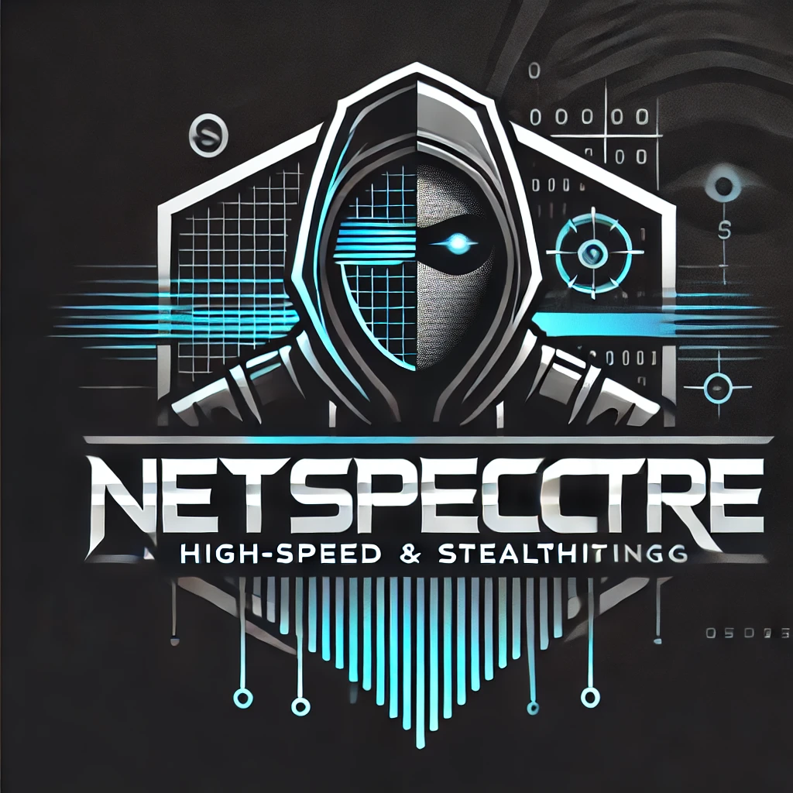
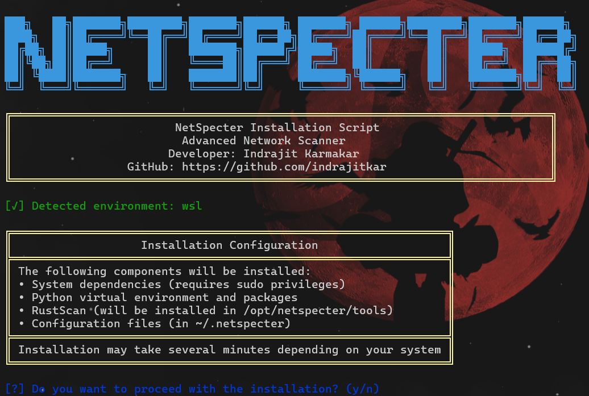
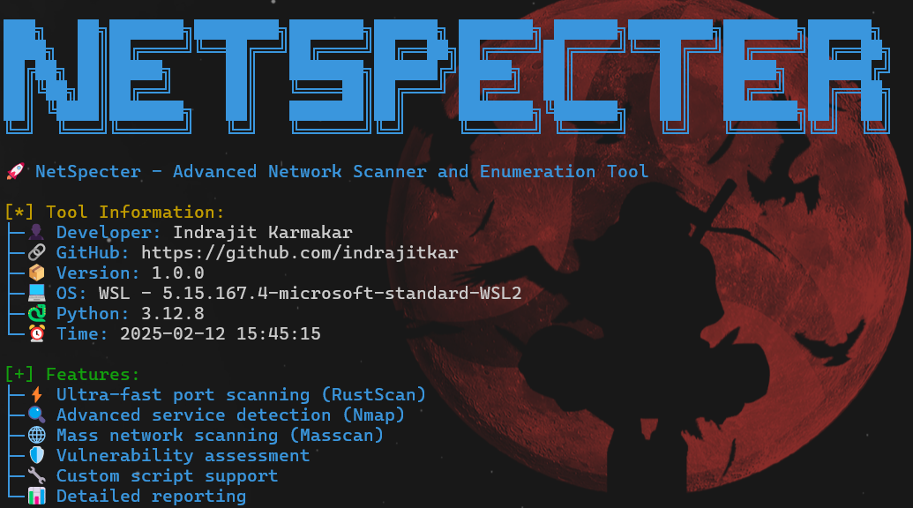
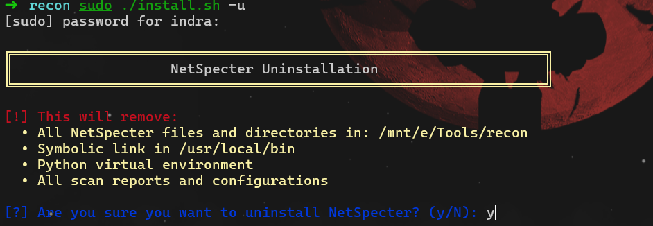

<p align="center">
  
</p>

<h1 align="center">NetSpecter</h1>
<p align="center">
  <strong>Advanced Network Scanner and Enumeration Tool</strong>
</p>

<p align="center">
  <a href="#installation">Installation</a> •
  <a href="#usage">Usage</a> •
  <a href="#features">Features</a> •
  <a href="#uninstallation">Uninstallation</a> •
  <a href="#license">License</a>
</p>

## 🚀 Features

- 🔍 Ultra-fast port scanning
- 🌐 Mass network scanning capabilities
- 🛡️ Service and OS detection
- ⚡ Vulnerability assessment
- 📊 Detailed reporting (JSON, XML)
- 🔧 Custom script support
- 🎯 Multiple scanning modes

## 📋 Prerequisites

- Python 3.x
- pip3
- Git
- sudo privileges

## 💻 Installation

1. Clone the repository:

```bash
git clone https://github.com/indrajitkar/netspecter.git
cd netspecter
```

2. Run the installation script:

```bash
./install.sh -i
```

<p align="center">
  
</p>

## 🎯 Usage

### Basic Commands:
```bash
# Show help menu
./netspecter.py scan --help

# Basic target scan
./netspecter.py scan -t 192.168.1.1

# Scan specific ports
./netspecter.py scan -t 192.168.1.1 -p 80,443,22

# Full service enumeration
./netspecter.py scan -t 192.168.1.1 -a

# Mass network scan
./netspecter.py scan -R 192.168.1.0/24
```

<p align="center">
  
</p>

### Advanced Features:
```bash
# Vulnerability scanning
./netspecter.py scan -t 192.168.1.1 -vuln

# Custom script execution
./netspecter.py scan -sc run custom_script.py

# Save results to file
./netspecter.py scan -t 192.168.1.1 -o results.json
```

## 🗑️ Uninstallation

To remove NetSpecter and all its components:

```bash
sudo ./uninstall.sh
```

<p align="center">
  
</p>

## 📝 License

This project is licensed under the MIT License - see the [LICENSE](LICENSE) file for details.

### Third-Party Tools

NetSpecter integrates with several open-source tools:

- [Nmap](https://nmap.org/) - Licensed under Nmap Public Source License
- [RustScan](https://github.com/RustScan/RustScan) - Licensed under MIT License
- [Masscan](https://github.com/robertdavidgraham/masscan) - Licensed under AGPL-3.0 License

## 🤝 Contributing

Contributions, issues, and feature requests are welcome! Feel free to check the [issues page](https://github.com/indrajitkar/netspecter/issues).

## 📧 Contact

Indrajit Karmakar - [@indrajitkar](https://github.com/indrajitkar)

Project Link: [https://github.com/indrajitkar/netspecter](https://github.com/indrajitkar/netspecter)

## ⭐ Support

If you find this project useful, please consider giving it a star ⭐

### 💖 Support My Work

If you'd like to support the development of NetSpecter and other open-source tools, you can:

<p align="center">
  <a href="https://www.paypal.me/IndrajitKarmakar1337">
    
  </a>
  ![UPI QR Code]
  <p align="center">
  
</p>
</p>

Your support helps maintain and improve this tool! 🙏

## 🙏 Acknowledgments

- Thanks to all the open-source tools that made this project possible
- Special thanks to the cybersecurity community for inspiration and support
- Grateful to all contributors and supporters

---

<p align="center">
  Made with ❤️ by Indrajit Karmakar
</p>
